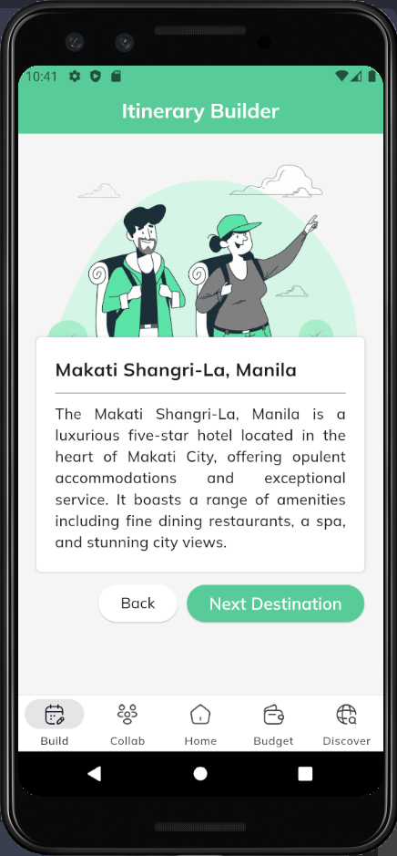
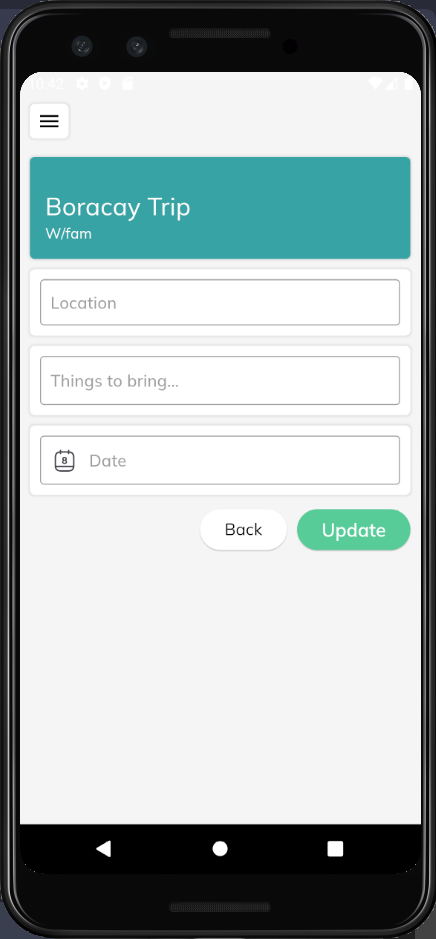
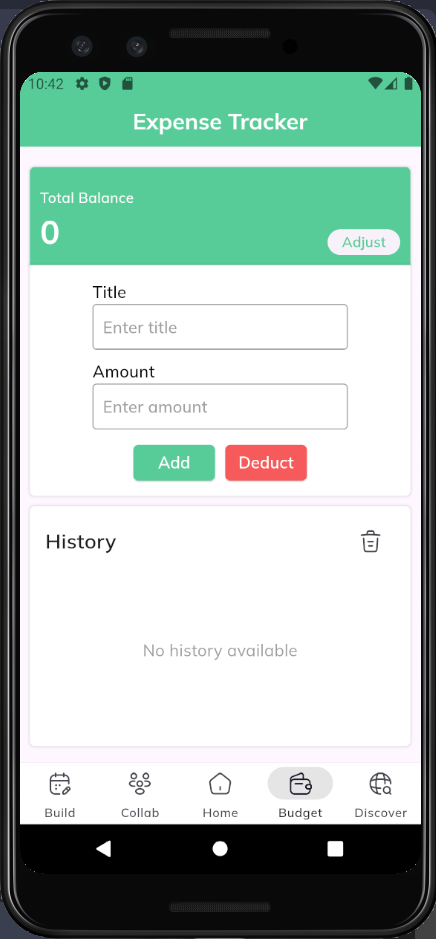
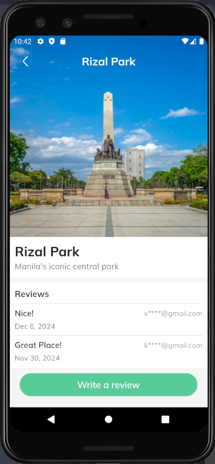

<div align="center">
  
  
  # TravelMate
  
  **Your Personal Travel Companion**
  
  
  
</div>

---

## **About**
📱 **TravelMate** is an Android mobile app developed using the Dart programming language. Its goal is to be your personal travel companion, assisting you as you explore any part of the world.

---

## **Technologies Used**
-   
-   
-   
- 🔥 Google Firestore/Firebase

---

## **How to Use**

🚀 To run this project:

1. **Using Android Studio:**
   - Open the project in Android Studio.
   - Run the app using an emulator or a physical device.

2. **Using VS Code:**
   - Open the terminal in VS Code.
   - Use the following command to build the APK:
     ```bash
     flutter build apk
     ```
   - Install the generated APK on your Android device.

---

## **Features**
✨ TravelMate offers various features to enhance your travel experience:

### 1. **Itinerary Builder** 🗺️
   - Input your current location (country, province, city).
   - Select preferences for travel recommendations.
   - Get personalized destination suggestions.

### 2. **Collaborative Planning** 🤝
   - Create a trip journal and invite other members (must have accounts).
   - All members can update trip details collaboratively.

### 3. **Expense Tracker** 💰
   - Track your trip budget dynamically.
   - Add, deduct, and adjust your total balance.
   - View a detailed history of changes.

### 4. **Discover** 🌟
   - Discover places and stores uploaded by business owners.
   - Leave reviews and ratings for places you visit.
   - Future monetization potential through advertisements.

---

## **Instructor**
👩‍🏫 Ms. Lysa Tolentino

---

## **Contributors**

| Role                 | Name                                    | GitHub Profile                               |
|----------------------|-----------------------------------------|----------------------------------------------|
| **Project Manager**  | Reinier Adrian Luna                    | [adnalow](https://github.com/adnalow)        |
| **Frontend Developer** | Kim Mathew Bautista                   | [KimMathew](https://github.com/KimMathew)    |
| **Backend Developers** | Gian Ezekiel Gersaniba                | [GianEzekiel](https://github.com/GianEzekiel) |
|                      | Vency Gyro Capistrano                  | [KazuMoment](https://github.com/KazuMoment)  |

---

## **Screenshots**

### Itinerary Builder
<div align="center">
  
  
</div>

### Collaborative Planning
<div align="center">
  
  
  
</div>

### Expense Tracker
<div align="center">
  
</div>

### Discover
<div align="center">
  
  
</div>


---
<div align="center">
  Made with ❤️ by Team TravelMate
</div>
